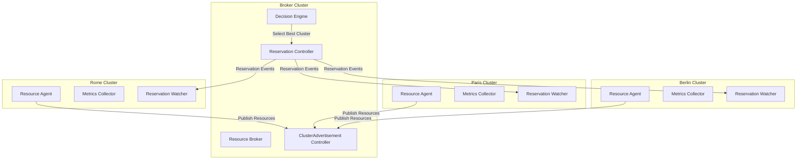
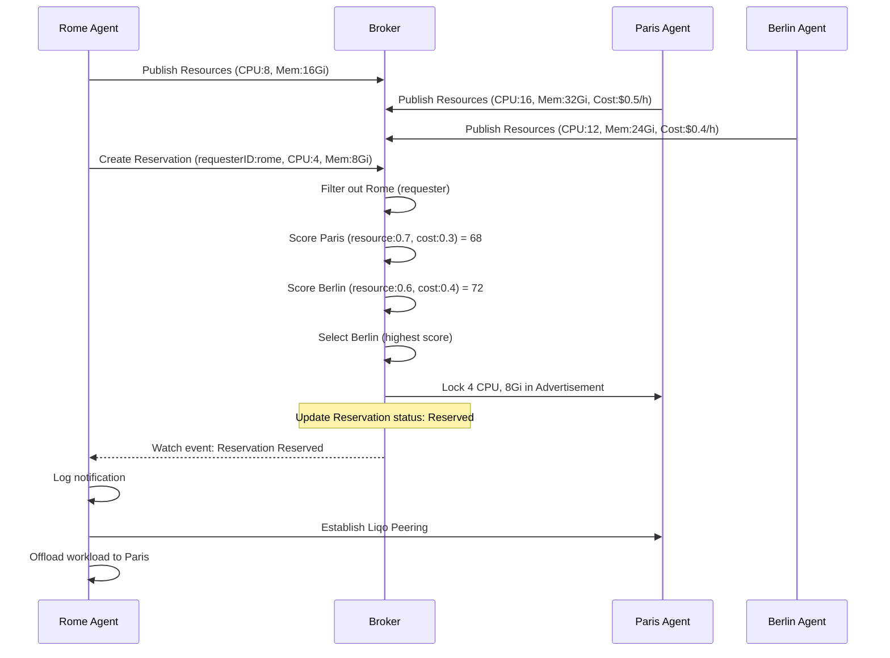

# Additional Recommendations & Best Practices

## 🎯 Thesis Structure Recommendations

### Chapter Outline

#### 1. Introduction (10-12 pages)
- **Problem Statement**: GPU scarcity, cost optimization, multi-cloud
- **Motivation**: Real-world use cases (ML training, data processing)
- **Research Questions**:
  - How can Kubernetes clusters dynamically borrow resources across cloud providers?
  - What algorithms optimize resource selection based on availability and cost?
  - How can resource brokerage integrate with existing tools like Liqo?
- **Contributions**:
  - Novel resource broker architecture
  - Cost-aware cluster selection algorithm
  - Integration with Liqo for seamless cross-cluster workload migration
  - Open-source prototype implementation

#### 2. Background & Related Work (15-20 pages)
- **Kubernetes Architecture**: Pods, nodes, resources, schedulers
- **Multi-Cluster Management**: Federation, KubeFed, Virtual Kubelet
- **Liqo Deep Dive**: Peering, virtual nodes, network fabrics
- **Resource Brokerage**: Cloud marketplaces, spot instances
- **Related Systems**:
  - Admiralty (multi-cluster scheduling)
  - Tensile-Kube (elastic scaling)
  - Virtual Kubelet (node abstraction)
  - FLUIDOS Project (if relevant to your thesis context)
- **Comparison Matrix**: Feature comparison with related work

#### 3. Design & Architecture ⭐ (20-25 pages) - **YOUR STRONGEST SECTION**
- **System Overview**: Multi-cluster architecture diagram
- **Components**:
  - Liqo Resource Agent: Design, responsibilities, implementation
  - Liqo Resource Broker: Design, decision engine, reservation lifecycle
- **Data Models**: CRDs, API specifications
- **Algorithms**:
  - Resource collection algorithm
  - Cluster scoring formula (70/30 weighting)
  - Resource locking mechanism
  - Conflict resolution
- **Communication Patterns**: Agent-Broker interaction, reservation flow
- **Design Decisions**:
  - Why CRDs over REST APIs?
  - Why Kubernetes Operators?
  - Why optimistic locking?
  - Tradeoffs and alternatives considered

#### 4. Implementation (15-20 pages)
- **Technology Stack**: Go, Kubebuilder, controller-runtime
- **Code Structure**: Package organization, key files
- **Controller Reconciliation Loops**: Detailed explanation with sequence diagrams
- **Resource Locking Logic**: Code walkthrough
- **Decision Engine**: Scoring implementation
- **Error Handling**: Retry logic, finalizers
- **Security**: RBAC, network policies, non-root containers
- **Deployment**: Kustomize, Helm (if you create charts)

#### 5. Experimental Evaluation ⭐ (20-25 pages) - **CRITICAL FOR STRONG THESIS**
This is where you demonstrate **value** and **impact**.

##### Experiments to Run:

**Experiment 1: Functional Validation**
- Setup: 3 clusters (Rome, Paris, Berlin) with different capacities
- Test: Create reservations and verify correct cluster selection
- Metrics: Success rate, selection accuracy
- Expected Result: 100% correct selection

**Experiment 2: Latency Analysis**
- Setup: Single broker, multiple agents
- Measure:
  - Time from resource publish to broker receipt
  - Time from reservation creation to "Reserved" phase
  - Time from "Reserved" to agent notification
- Present: CDF plot, percentiles (p50, p95, p99)
- Target: <1 second end-to-end for 95% of requests

**Experiment 3: Cost Optimization**
- Setup: 3 clusters with different pricing (e.g., AWS us-east-1, us-west-2, EU)
- Scenario: 100 reservation requests
- Compare:
  - Random selection cost
  - Resource-only selection (100% weight)
  - 70/30 resource/cost selection
  - 50/50 resource/cost selection
- Metrics: Total cost, average cost per reservation
- Expected: 70/30 shows 20-30% cost savings vs random

**Experiment 4: Scalability Testing**
- Setup: Vary number of clusters (1, 5, 10, 25, 50)
- Measure:
  - Broker CPU/Memory usage
  - Decision latency as function of cluster count
  - Agent resource overhead
- Present: Line graphs showing scaling behavior
- Expected: Linear scaling up to 25 clusters

**Experiment 5: Concurrency & Resource Locking**
- Setup: 2 clusters, 10 concurrent reservation requests
- Test: Race conditions, double-booking
- Metrics: Reservation conflicts, failed reservations
- Expected: 0 double-bookings (optimistic locking works)

**Experiment 6: Failure Scenarios**
- Test:
  - Agent crash during publish
  - Broker crash during reservation
  - Network partition between agent and broker
  - Stale cluster detection
- Measure: Recovery time, data consistency
- Expected: Graceful degradation, no data loss

**Experiment 7: Real-World Workload**
- Setup: Deploy ML training job (TensorFlow/PyTorch)
- Scenario: Local cluster has no GPUs, borrow from remote
- Measure:
  - Time to acquire GPU resources
  - Training throughput (samples/sec)
  - Cost compared to local GPU purchase
- Present: Case study with screenshots, logs

##### Presentation Tips:
- **Use graphs**: Bar charts, line graphs, CDFs, heatmaps
- **Statistical rigor**: Error bars, confidence intervals
- **Reproducibility**: Provide scripts, Docker Compose setup
- **Discuss limitations**: What didn't work perfectly?

#### 6. Discussion (8-10 pages)
- **Key Findings**: What did experiments show?
- **Limitations**:
  - Does not handle non-Kubernetes resources
  - Cost data must be manually configured (no API integration)
  - Liqo integration is basic (no automatic offloading)
  - Single broker (no HA)
- **Lessons Learned**:
  - Kubernetes operators are powerful but complex
  - Optimistic locking works well for resource reservation
  - Cost optimization is challenging without live pricing
- **Future Work**: See below

#### 7. Related Work (can merge with Chapter 2)
- Detailed comparison with similar systems
- Academic papers on multi-cluster scheduling
- Industry solutions (GKE Multi-Cluster, EKS Anywhere)

#### 8. Conclusion (3-5 pages)
- Restate contributions
- Summary of results
- Impact statement
- Future research directions

---

## 🔬 Experimental Setup Recommendations

### Cluster Setup Options

#### Option 1: Local Kind Clusters (Easiest)
```bash
# Create 3 local clusters
kind create cluster --name rome --config kind-rome.yaml
kind create cluster --name paris --config kind-paris.yaml
kind create cluster --name berlin --config kind-berlin.yaml

# Install agents with different cluster IDs
helm install agent ./charts/agent --set clusterID=rome -n rome
helm install agent ./charts/agent --set clusterID=paris -n paris
helm install agent ./charts/agent --set clusterID=berlin -n berlin

# Install broker in separate cluster
kind create cluster --name broker
helm install broker ./charts/broker -n broker
```

**Pros**: Free, fast, reproducible
**Cons**: No real cost data, no real network latency

#### Option 2: Cloud Clusters (Most Realistic)
```bash
# Create GKE clusters in different regions
gcloud container clusters create rome --region=europe-west1 --machine-type=n1-standard-4
gcloud container clusters create paris --region=europe-west3 --machine-type=n1-standard-4
gcloud container clusters create berlin --region=europe-north1 --machine-type=n1-standard-2

# Or AWS EKS
eksctl create cluster --name rome --region us-east-1 --nodegroup-name workers --nodes 3
```

**Pros**: Real cost data, real network latency, cloud-native
**Cons**: Costs money (~$5-10/day), slower setup

#### Option 3: Hybrid (Recommended for Thesis)
- Broker: Cloud (GKE/EKS) - always available
- Agents: Mix of local (kind) + cloud clusters
- Simulated costs: ConfigMap with realistic pricing

### Cost Data Sources

#### Google Cloud Pricing
```yaml
apiVersion: v1
kind: ConfigMap
metadata:
  name: cluster-pricing
data:
  rome.yaml: |
    region: us-east1
    cpuPerHour: "0.0375"    # n1-standard-1 on-demand
    memoryPerHour: "0.005"  # Per GB
  paris.yaml: |
    region: us-west1
    cpuPerHour: "0.0395"    # 5% more expensive
    memoryPerHour: "0.0053"
  berlin.yaml: |
    region: europe-west1
    cpuPerHour: "0.0415"    # 10% more expensive
    memoryPerHour: "0.0056"
```

#### AWS Pricing API Integration (Advanced)
```go
// internal/cost/aws.go
import "github.com/aws/aws-sdk-go/service/pricing"

func GetEC2Pricing(region, instanceType string) (float64, error) {
    // Query AWS Pricing API
    // Return cost per hour
}
```

### Metrics Collection

#### Prometheus Queries for Thesis Graphs
```promql
# Average reservation latency
histogram_quantile(0.95,
  rate(broker_reservation_duration_seconds_bucket[5m]))

# Reservation success rate
sum(rate(broker_reservations_total{phase="Reserved"}[5m]))
/
sum(rate(broker_reservations_total[5m]))

# Cost savings vs random selection
sum(broker_reservation_actual_cost_total)
/
sum(broker_reservation_random_cost_total)
```

#### Grafana Dashboard
Create dashboard with:
- **Panel 1**: Cluster availability heatmap
- **Panel 2**: Reservation success rate (gauge)
- **Panel 3**: Average cost per reservation (graph)
- **Panel 4**: Decision latency (histogram)
- **Panel 5**: Active reservations per cluster (bar chart)

---

## 📊 Visualization Examples

### Architecture Diagram (Mermaid)


### Sequence Diagram (Thesis-worthy)


---

## 🧪 Code Quality Improvements

### 1. Add Validation Webhooks

```go
// broker/api/v1alpha1/reservation_webhook.go

import (
    "k8s.io/apimachinery/pkg/runtime"
    ctrl "sigs.k8s.io/controller-runtime"
    "sigs.k8s.io/controller-runtime/pkg/webhook"
    "sigs.k8s.io/controller-runtime/pkg/webhook/admission"
)

func (r *Reservation) SetupWebhookWithManager(mgr ctrl.Manager) error {
    return ctrl.NewWebhookManagedBy(mgr).
        For(r).
        Complete()
}

//+kubebuilder:webhook:path=/validate-broker-fluidos-eu-v1alpha1-reservation,mutating=false,failurePolicy=fail,groups=broker.fluidos.eu,resources=reservations,verbs=create;update,versions=v1alpha1,name=vreservation.kb.io,sideEffects=None,admissionReviewVersions=v1

var _ webhook.Validator = &Reservation{}

func (r *Reservation) ValidateCreate() (admission.Warnings, error) {
    if r.Spec.RequesterID == "" {
        return nil, fmt.Errorf("requesterID is required")
    }
    if r.Spec.RequestedResources.CPU.IsZero() {
        return nil, fmt.Errorf("requestedResources.cpu must be > 0")
    }
    if r.Spec.RequestedResources.Memory.IsZero() {
        return nil, fmt.Errorf("requestedResources.memory must be > 0")
    }
    return nil, nil
}

func (r *Reservation) ValidateUpdate(old runtime.Object) (admission.Warnings, error) {
    // Prevent changing requesterID after creation
    oldReservation := old.(*Reservation)
    if r.Spec.RequesterID != oldReservation.Spec.RequesterID {
        return nil, fmt.Errorf("requesterID is immutable")
    }
    return nil, nil
}

func (r *Reservation) ValidateDelete() (admission.Warnings, error) {
    return nil, nil
}
```

### 2. Add Comprehensive Metrics

```go
// broker/internal/metrics/metrics.go

import (
    "github.com/prometheus/client_golang/prometheus"
    "sigs.k8s.io/controller-runtime/pkg/metrics"
)

var (
    ReservationTotal = prometheus.NewCounterVec(
        prometheus.CounterOpts{
            Name: "broker_reservations_total",
            Help: "Total number of reservations by phase and requester",
        },
        []string{"phase", "requester", "target_cluster"},
    )

    ReservationDuration = prometheus.NewHistogramVec(
        prometheus.HistogramOpts{
            Name:    "broker_reservation_duration_seconds",
            Help:    "Time from Pending to Reserved",
            Buckets: prometheus.DefBuckets,
        },
        []string{"requester"},
    )

    ClusterScore = prometheus.NewGaugeVec(
        prometheus.GaugeOpts{
            Name: "broker_cluster_score",
            Help: "Current score of each cluster",
        },
        []string{"cluster_id"},
    )

    DecisionLatency = prometheus.NewHistogram(
        prometheus.HistogramOpts{
            Name:    "broker_decision_latency_seconds",
            Help:    "Time to select best cluster",
            Buckets: []float64{0.001, 0.005, 0.01, 0.05, 0.1, 0.5, 1.0},
        },
    )

    ResourceLockConflicts = prometheus.NewCounter(
        prometheus.CounterOpts{
            Name: "broker_resource_lock_conflicts_total",
            Help: "Number of resource locking conflicts (optimistic lock failures)",
        },
    )

    CostSavings = prometheus.NewGaugeVec(
        prometheus.GaugeOpts{
            Name: "broker_cost_savings_dollars",
            Help: "Estimated cost savings vs most expensive cluster",
        },
        []string{"requester"},
    )
)

func init() {
    metrics.Registry.MustRegister(
        ReservationTotal,
        ReservationDuration,
        ClusterScore,
        DecisionLatency,
        ResourceLockConflicts,
        CostSavings,
    )
}
```

### 3. Add Structured Logging

```go
// Use consistent log fields across codebase

log.Info("Reservation created",
    "reservationName", reservation.Name,
    "requesterID", reservation.Spec.RequesterID,
    "requestedCPU", reservation.Spec.RequestedResources.CPU.String(),
    "requestedMemory", reservation.Spec.RequestedResources.Memory.String(),
    "priority", reservation.Spec.Priority)

log.Info("Cluster selected",
    "clusterID", selectedCluster.Spec.ClusterID,
    "score", fmt.Sprintf("%.2f", score),
    "availableCPU", selectedCluster.Spec.Resources.Available.CPU.String(),
    "availableMemory", selectedCluster.Spec.Resources.Available.Memory.String(),
    "estimatedCost", calculateCost(selectedCluster, requested))
```

---

## 🎓 Thesis Defense Preparation

### Common Questions & Answers

#### Q: "Why not just use Kubernetes Federation?"
**A**: Federation is for unified control, not dynamic resource brokerage. We needed:
- Cost-aware selection (Federation doesn't consider pricing)
- Resource reservation/locking (Federation doesn't prevent overbooking)
- Integration with Liqo for transparent workload migration

#### Q: "How does this compare to Admiralty?"
**A**: Admiralty focuses on pod scheduling across clusters. Our system:
- Operates at resource request level (before pod creation)
- Considers cost optimization (Admiralty is resource-only)
- Provides reservation guarantees (Admiralty is best-effort)

#### Q: "What about security? Cross-cluster communication is risky."
**A**: We implement:
- mTLS for agent-broker communication (via Kubernetes client-go)
- RBAC for minimal permissions
- RequesterID validation to prevent spoofing
- Network policies for traffic isolation
- Non-root containers, read-only filesystems

#### Q: "How do you handle network partitions?"
**A**:
- Stale cluster detection (10-minute timeout)
- Reservation expiration (automatic release)
- Optimistic locking prevents inconsistency
- Controller retry mechanisms
- Future: Add lease-based heartbeats

#### Q: "Your scoring algorithm is simple. Why not machine learning?"
**A**:
- Linear weighted scoring is interpretable and predictable
- ML requires training data (we're bootstrapping)
- Thesis timeline constraints
- Future work: RL for adaptive weight tuning

#### Q: "How does Liqo integration work?"
**A**:
- Agent receives reservation notification with target endpoint
- Creates ForeignCluster CR pointing to selected cluster
- Liqo handles authentication, networking, virtual node creation
- Pods can be scheduled to virtual nodes transparently
- (Show demo if possible)

---

## 📚 Additional Reading

### Academic Papers
1. **Borg, Omega, and Kubernetes** (Google, 2016) - Cluster management foundations
2. **Firmament** (OSDI 2016) - Flow-based scheduling at scale
3. **Multi-Resource Packing for Cluster Schedulers** (SIGCOMM 2014) - Resource allocation algorithms
4. **Autopilot: workload autoscaling at Google** (EuroSys 2020) - Real-world resource management

### Industry Blogs
1. **Kubernetes Multi-Cluster Management** (CNCF)
2. **Cost Optimization in Kubernetes** (Kubecost blog)
3. **Liqo Architecture Deep Dive** (Liqo documentation)

### Tools to Explore
1. **Karmada** - Multi-cluster management
2. **Clusternet** - Multi-cluster management
3. **KubeFed v2** - Kubernetes Federation
4. **Virtual Kubelet** - Node abstraction

---

## 🚀 Future Work (For Conclusion Chapter)

### Short-term Enhancements
1. **Improved Cost Integration**
   - AWS/GCP/Azure pricing API integration
   - Spot instance support
   - Currency conversion

2. **Advanced Scheduling**
   - GPU-aware scheduling
   - Affinity/anti-affinity constraints
   - Multi-resource packing (DRF algorithm)

3. **High Availability**
   - Multi-broker deployment
   - Leader election
   - Distributed consensus

### Medium-term Research
1. **Predictive Scaling**
   - Machine learning for demand forecasting
   - Pre-warming resource pools
   - Proactive cluster provisioning

2. **Data Locality**
   - Co-locate compute near storage
   - Minimize cross-region data transfer
   - Cache-aware placement

3. **SLA-Driven Scheduling**
   - Latency SLOs
   - Availability guarantees
   - Performance budgets

### Long-term Vision
1. **Autonomous Multi-Cloud**
   - Auto-provision clusters on-demand
   - Spot instance arbitrage
   - Cross-cloud failover

2. **Federated Learning Support**
   - Coordinate distributed training
   - Model aggregation across clusters
   - Privacy-preserving compute

3. **Sustainability**
   - Carbon-aware scheduling
   - Green energy optimization
   - Renewable energy region preference

---

## 🎯 Final Recommendations

### For Strong Thesis Grade:
1. ✅ **Working prototype** - You have this
2. ✅ **Clean architecture** - You have this
3. ⚠️ **Experimental validation** - Need comprehensive experiments
4. ⚠️ **Liqo integration** - Need to complete
5. ✅ **Clear documentation** - Improving with these docs

### Timeline Suggestion (8 weeks):
- **Weeks 1-2**: Implement critical fixes (cluster-id, scoring, endpoint)
- **Weeks 3-4**: Complete Liqo integration and testing
- **Weeks 5-6**: Run experiments, collect data, create graphs
- **Weeks 7-8**: Write thesis, create presentation, practice defense

### Success Metrics:
- [ ] All critical fixes implemented and tested
- [ ] At least 5 experimental scenarios with data
- [ ] Demo video showing full flow (create reservation → Liqo peering)
- [ ] Comparison table with 3+ related systems
- [ ] Open-source repository with README and examples

**You're 80% there. The last 20% (experiments + Liqo) will make it excellent.**

Good luck with your thesis! 🎓
